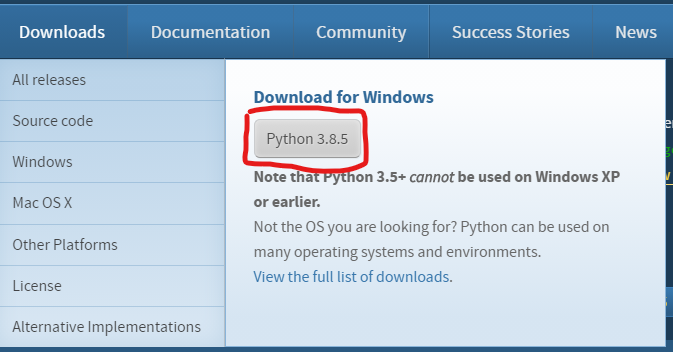
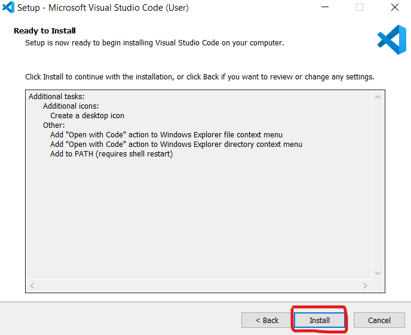

# Módulo 3 Introducción a las arquitecturas y desarrollo con API Rest - Clase 1 

## Instalación de Python, VSCODE, Venv y Flask


### Instalación de Python

Ingresamos al sitio https://www.python.org/ y le damos click a Downloads


Descargue la versión para su sistema Operativo. En el caso de Windows Python 3.8.5



Una vez termine la descarga, haga doble click en el archivo, Agregar Python 3.8 al path y luego en Instalar Ahora


Después de terminada la instalación, haga click en Deshabilitar el límite de longitud del Path


### Instalación de VSCode

Ingresamos al sitio https://www.python.org/ y le damos click a Download para el sistema operativo que estemos utilizando


Hacemos doble click en el archivo y aceptamos los términos y condiciones


En la siguiente pantalla le damos click a Crear icono en el escritorio y de nuevo siguiente


Hacemos click en Instalar



Finalmente, hacemos click en Terminar y Lanzar Visual Studio Code


Si nos sale una alerta de Firewall, hacemos click en Permitir acceso


Se recomienda instalar las extensiones de Python y Python Docstring Generator. Para hacerlo deben ir a la pestaña de extensiones, buscar Python y luego hacer click en instalar


Para instalar Python DocString, busca python doc, seleccionan la extensión y click en Instalar


### Instalación del Virtual Environment

El Virtual Environment nos permite crear grupos independientes de librerías en Python para cada proyecto. Esto resuelve posibles conflictos que se pueden presentar al trabajar diferentes versiones de una librería o del mismo Python si estás son instaladas de forma global

Creamos una carpeta, por ejemplo gestion-estudiantes, y adentro creamos la carpeta server.

Vamos a VsCode y hacemos click en Archivo - Abrir Carpeta, seleccionamos la carpeta de gestion-estudiantes y dentro de la carpeta server, creamos dos archivos:

- app.py
- requirements.txt

En caso de que VSCode nos pregunte que interprete utilizar para Python, seleccionamos la versión instalada


VsCode nos va a sugerir que utilicemos pylint para revisar nuestro código, hacemos click en Instalar


Hacemos click en Terminal y ejecutamos los siguientes comandos:

```bash
py 3 -m venv .venv
source .venv/bin/activate
```


Si se genera el mensaje "Activate.ps1 is not digitally signed. You cannot run this script on the current system.", entonces debe ejecutar 

```bash
Set-ExecutionPolicy -ExecutionPolicy RemoteSigned -Scope Process
source .venv/bin/activate
```


Si esta trabajando en MacOs o Linux, ejecute los siguientes comandos

```bash
python3 -m venv .venv
source .venv/bin/activate
```


### Instalación y Ejecución de Flask

En el archivo requirements.tx incluya la librería de Flask

```python
Flask==1.1.2
```

En la terminal ejecutamos el siguiente comando:

En Windows:

```bash
pip install -r requirements.txt
```

En MacOS/Linux:

```bash
pip3 install -r requirements.txt
```

En el archivo app.py importe Flask y cree una instancia de un objeto de Flask

```python
from flask import Flask
app = Flask(__name__)
```
Adicione también en el archivo app.py, una función que retorne algun contenido, en este caso, un string; use, además, el decorador app.route para mapear la ruta del URL / a esa función:

```python
@app.route("/")
def hola_mundo():
  return "Hola, Mundo!"
```
Guarde la aplicación app.py (cmd/ctrl S).

En la terminal, ejecute la aplicación mediante el comando:

En Windows:
```bash
python -m flask run --reload
```

En MacOS/Linux
```bash
python3 -m flask run --reload
```

El servidor busca la aplicacción app.py por defecto. Al correr Flask, verá una salida similar a la siguiente:
```bash
(env) python -m flask run --reload
 * Environment: production
   WARNING: Do not use the development server in a production environment.
   Use a production WSGI server instead.
 * Debug mode: off
 * Running on http://127.0.0.1:5000/ (Press CTRL+C to quit)
```

Abrimos en un navegador la ruta localhost:5000, y debemos ver el mensaje Hola, Mundo!

Cambiemos algo del código

```python
from flask import Flask
app = Flask(__name__)


@app.route("/")
def hola_mundo():
  return "Adios, Mundo!"
```

Se actualizará automáticamente, y si ingresamos de nuevo a la ruta, veremos el nuevo mensaje.

Agreguemos una nueva ruta pero con un parametro. La f indica un string con formato, el nombre es reemplazado por el parámetro que recibe la función

```python
@app.route("/saludo/<nombre>")
def saludo(nombre):
  return f"Hola {nombre}"
```

Podemos indicar el tipo de dato que va a recibir la ruta de la siguiente forma

```python
@app.route("/saludo/<string:nombre>")
def saludo(nombre):
  return f"Hola {nombre}"
```

Agregemos un parámetro dentro de la query de la ruta: titulo

```python
@app.route("/saludo/<string:nombre>")
def saludo(nombre):
  titulo = request.args.get('titulo', '')
  return f"Hola {titulo} {nombre}"
```

En un navegador ingresamos la ruta incluyendo el parámetro

http://localhost:5000/saludo/jaime?titulo=Mr


```python
@app.route("/estudiantes/<int:id>/notas")
def notas(id):
  notas=[4,3,2,1,3]
  return f"Las notas del (la) estudiante con ID {id} son {notas}"
```

```python
@app.route("/estudiantes/<int:id>/notas")
def notas(id):
  notas={
  "11234224":[4,3,2,1,2],
  "12434236":[5,3,5,5,5],
  "61236224":[1,3,2,1,1],
  "52433236":[3,3,3,3,3]
  }
  notas_estudiante=notas[str(id)]
  return f"Las notas del (la) estudiante con ID {id} son {(notas_estudiante)}"
```

# Agregamos ruta


from flask import Flask,request
app = Flask(__name__)

estudiantesDB={
"11234224":{
  "nombre":"Juana Correa",
  "notas":[4,3,2,1,2]
},
"12434236":{
  "nombre":"Jaime García",
  "notas":[5,3,5,5,5]
},
"61236224":{
  "nombre":"Roberta Mejía",
  "notas":[1,3,2,1,1]
},
"52433236":{
  "nombre":"Miriam Zapata",
  "notas":[3,3,3,3,3]
}
}


@app.route("/")
def hola_mundo():
  return "Adiós, Mundo!"


@app.route("/saludo/<string:nombre>")
def saludo(nombre):
  titulo = request.args.get('titulo', '')
  return f"Hola {titulo} {nombre}"


@app.route("/estudiantes/<int:id>")
def estudiantes(id):
  print("estudiante",estudiantesDB[str(id)])
  nombre_estudiante=estudiantesDB[str(id)]['nombre']
  return f"La estudiante con ID {id} se llama {nombre_estudiante}"

@app.route("/estudiantes/<int:id>/notas")
def notas(id):

  notas_estudiante=estudiantesDB[str(id)]['notas']
  return f"Las notas del (la) estudiante con ID {id} son {(notas_estudiante)}"


# Agregamos formato
@app.route("/estudiantes/<int:id>/notas")
def notas(id):

  notas_estudiante=estudiantesDB[str(id)]['notas']
  notas_estudiante_str=", ".join(map(str, notas_estudiante))
  return f"Las notas del (la) estudiante con ID {id} son {notas_estudiante_str}"


# Agregamos una consulta


@app.route("/estudiantes")
def estudiantes_lista():
  lista_estudiantes=[]
  for estudiante in estudiantesDB.keys():
    lista_estudiantes.append(estudiantesDB[estudiante]["nombre"])

  return f"Los estudiantes de este curso son {lista_estudiantes}"


REST

REpresentational State Transfer*
- Concepts include:
• Separation of Client and Server
• Server Requests are Stateless
• Cacheable Requests
• Uniform Interface


Use pronombres en plural para indicar los recursos asociados

estudiantes


estudiantes/1324345

El identificador a la derecha del recurso indica que se va a realizar operaciones con el Estudiante con ID  1324345

estudiantes/1324345/tareas

Si el recurso tiene asociado

/v1/estudiantes/1324345/tareas/12

Utilice los query strings para propiedades no asociadas a los recurso

/estudiantes?ordenar=nombre
/estudiantes?pagina=1
/estudiantes?formato=json


string

(default) accepts any text without a slash

int

accepts positive integers

float

accepts positive floating point values

path

like string but also accepts slashes

uuid

accepts UUID strings


Utilice los verbos de HTTP siempre que sea posible

GET
- Obtiene un recurso
POST
- Agrega un nuevo recurso 
PUT
- Actualiza un recurso existente
PATCH
- Actualiza de forma parcial un recurso existente
DELETE
- Borra un recurso existente


POST /estudiantes/1324345/tareas/12/aprobar


| Recurso  | GET | POST | PUT | DELETE |
| ------------- | ------------- | ------------- | ------------- | ------------- |
| /estudiantes  | Obtener Lista  | Crear elemento  | Actualizar Batch  | Error |
| /estudiantes/1324345  | Obtener Elemento  | Error  | Actualizar Elemento  | Borrar Elemento |


Idempotencia: Operación que puede ser aplica múltiples veces, sin cambiar el resultado

- GET, PUT, PATCH y DELETE: Idempotentes
- POST no es idempotente


Diseñando resultados


Sea consistente (snake_case, camelCase, spinal-case)
No expongan datos de servidor
No exponga datos privados
No exponga datos que puedan generar brechas de seguridad