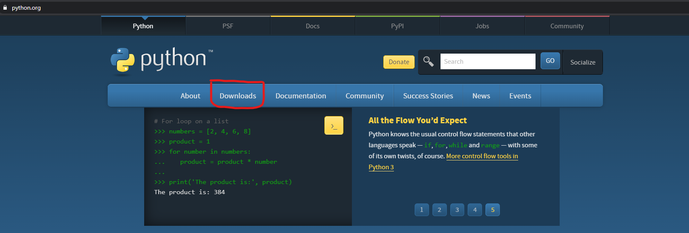
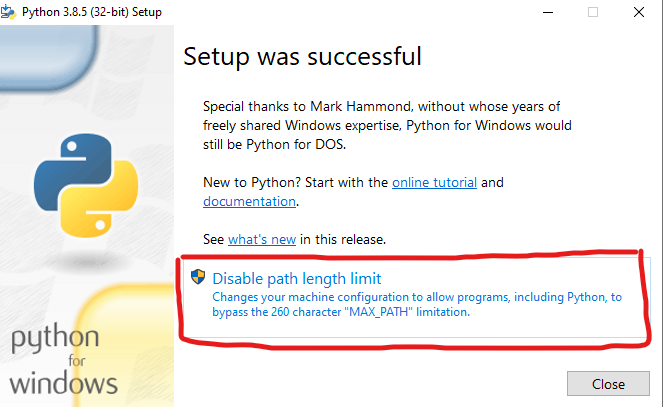
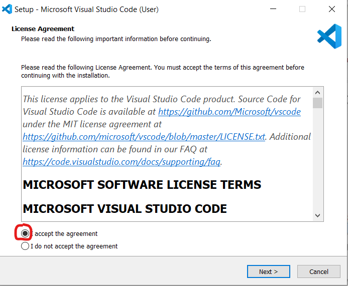
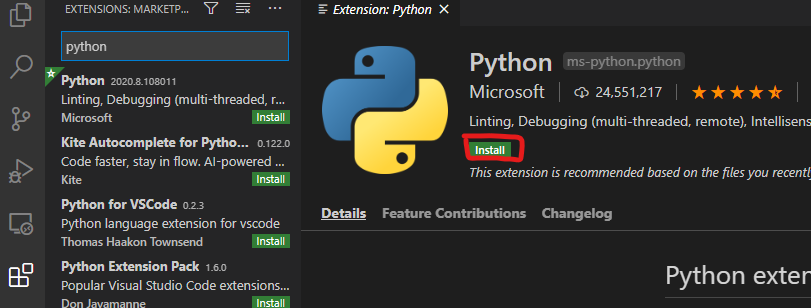

# Módulo 3 Introducción a las arquitecturas y desarrollo con API Rest - Clase 1 

# Tabla de Contenido

<!-- toc -->

- [Instalación de Python, VSCODE, Venv y Flask](#instalación-de-python-vscode-venv-y-flask)
  - [Instalación de Python](#instalación-de-python)
  - [Instalación de VSCode](#instalación-de-vscode)
  - [Instalación del Virtual Environment](#instalación-del-virtual-environment)
  - [Instalación y Ejecución de Flaskt](#instalación-y-ejecución-de-flask)
- [Desarrollo de REST API](#desarrollo-de-rest-api)

<!-- tocstop -->

## Instalación de Python, VSCODE, Venv y Flask


### Instalación de Python

Ingresamos al sitio https://www.python.org/ y le damos click a Downloads



Descargue la versión para su sistema Operativo. En el caso de Windows Python 3.8.5


Una vez termine la descarga, haga doble click en el archivo, Agregar Python 3.8 al path y luego en Instalar Ahora


Después de terminada la instalación, haga click en Deshabilitar el límite de longitud del Path




### Instalación de VSCode

Ingresamos al sitio https://www.python.org/ y le damos click a Download para el sistema operativo que estemos utilizando


Hacemos doble click en el archivo y aceptamos los términos y condiciones



En la siguiente pantalla le damos click a Crear icono en el escritorio y de nuevo siguiente


Hacemos click en Instalar


Finalmente, hacemos click en Terminar y Lanzar Visual Studio Code


Si nos sale una alerta de Firewall, hacemos click en Permitir acceso


Se recomienda instalar las extensiones de Python y Python Docstring Generator. Para hacerlo deben ir a la pestaña de extensiones, buscar Python y luego hacer click en instalar



Para instalar Python DocString, busca python doc, seleccionan la extensión y click en Instalar


### Instalación del Virtual Environment

El Virtual Environment nos permite crear grupos independientes de librerías en Python para cada proyecto. Esto resuelve posibles conflictos que se pueden presentar al trabajar diferentes versiones de una librería o del mismo Python si estás son instaladas de forma global

Creamos una carpeta, por ejemplo gestion-estudiantes, y adentro creamos la carpeta server.

Vamos a VsCode y hacemos click en Archivo - Abrir Carpeta, seleccionamos la carpeta de gestion-estudiantes y dentro de la carpeta server, creamos dos archivos:

- app.py
- requirements.txt

En caso de que VSCode nos pregunte que interprete utilizar para Python, seleccionamos la versión instalada


VsCode nos va a sugerir que utilicemos pylint para revisar nuestro código, hacemos click en Instalar


Hacemos click en Terminal y ejecutamos los siguientes comandos:

```bash
py 3 -m venv .venv
.\venv\Scripts\activate
```


Si se genera el mensaje "Activate.ps1 is not digitally signed. You cannot run this script on the current system.", entonces debe ejecutar 

```bash
Set-ExecutionPolicy -ExecutionPolicy RemoteSigned -Scope Process
source .venv/bin/activate
```


Si esta trabajando en MacOs o Linux, ejecute los siguientes comandos

```bash
python3 -m venv .venv
source .venv/bin/activate
```


### Instalación y Ejecución de Flask

En el archivo requirements.tx incluya la librería de Flask

```python
Flask==1.1.2
```

En la terminal ejecutamos el siguiente comando:

En Windows:

```bash
pip install -r requirements.txt
```

En MacOS/Linux:

```bash
pip3 install -r requirements.txt
```

En el archivo app.py importe Flask y cree una instancia de un objeto de Flask

```python
from flask import Flask
app = Flask(__name__)


if __name__ == '__main__':
    app.run(debug=True)
```
Adicione también en el archivo app.py, una función que retorne algun contenido, en este caso, un string; use, además, el decorador app.route para mapear la ruta del URL / a esa función:

```python
@app.route("/")
def hola_mundo():
  return "Hola, Mundo!"
```
Guarde la aplicación app.py (cmd/ctrl S).

En la terminal, ejecute la aplicación mediante el comando:

En Windows:
```bash
python -m flask run --reload
```

En MacOS/Linux
```bash
python3 -m flask run --reload
```

El servidor busca la aplicacción app.py por defecto. Al correr Flask, verá una salida similar a la siguiente:
```bash
(env) python -m flask run --reload
 * Environment: production
   WARNING: Do not use the development server in a production environment.
   Use a production WSGI server instead.
 * Debug mode: off
 * Running on http://127.0.0.1:5000/ (Press CTRL+C to quit)
```

Abrimos en un navegador la ruta localhost:5000, y debemos ver el mensaje Hola, Mundo!

Cambiemos algo del código

```python
from flask import Flask
app = Flask(__name__)


@app.route("/")
def hola_mundo():
  return "Adios, Mundo!"
```

Se actualizará automáticamente, y si ingresamos de nuevo a la ruta, veremos el nuevo mensaje.

Agreguemos una nueva ruta pero con un parametro. La f indica un string con formato, el nombre es reemplazado por el parámetro que recibe la función

```python
@app.route("/saludo/<nombre>")
def saludo(nombre):
  return f"Hola {nombre}"
```

Podemos indicar el tipo de dato que va a recibir la ruta de la siguiente forma

```python
@app.route("/saludo/<string:nombre>")
def saludo(nombre):
  return f"Hola {nombre}"
```

Agregemos un parámetro dentro de la query de la ruta: titulo.

Primero debemos importar request de Flask
```python
from flask import Flask,request
```

```python
@app.route("/saludo/<string:nombre>")
def saludo(nombre):
  titulo = request.args.get('titulo', '')
  return f"Hola {titulo} {nombre}"
```

En un navegador ingresamos la ruta incluyendo el parámetro, la respuesta que obtenemos 

```
http://localhost:5000/saludo/jaime?titulo=Sr
```


Así queda el código con estas dos rutas:

```python
from flask import Flask,request
import sys

app = Flask(__name__)

@app.route("/")
def hola_mundo():
  print("holas")
  return "Adiós, Mundo!"


@app.route("/saludo/<string:nombre>")
def saludo(nombre):
  titulo = request.args.get('titulo', '')
  return f"Hola {titulo} {nombre}"

if __name__ == '__main__':
    app.run(debug=True)
```

Ejercicio: Agreguen una nueva ruta que se llame despedida, deb recibir como parte la ruta un string el nombre de la persona y como parámetro la frase de despedida (Chao, Adiós, Sayonara). Es decir que si se ingresa a la ruta /despedida/jaime?tipo=Sayonara la respuesta que debemos obtener es Sayonara jaime


### Instalación de Rest Client o Postman

Vamos a utilizar un Cliente para conectarnos con las APIs que se van a crear. Se recomienda la extensión Rest Client de VSCode. 

Para instalar Rest Client, vaya a extensiones en VSCode busque Rest Client, haga click en Instalar y Recargue VSCode


También puede utilizar Postman. Para instalar Postman, ingrese a https://www.postman.com/, registrese y descargué el producto


## Desarrollo de REST API

Vamos a crear una base de datos en un diccionario local
```python
estudiantes_db={
  "11234224":{
    "cedula":11234224,
    "nombre":"Juana",
    "apellido":"Correa",
    "correo":"juana.correa@misena.edu.co",
    "carrera":"Electrónica"
  },
  "12434236":{
    "cedula":12434236,
    "nombre":"Jaime",
    "apellido":"García",
    "correo":"jaime.garcia@misena.edu.co",
    "carrera":"Administración"
  },
  "61236224":{
    "cedula":61236224,
    "nombre":"Roberta",
    "apellido":"Mejia",
    "correo":"roberta.mejia@misena.edu.co",
    "carrera":"Sistemas"
  },
  "52433236":{
    "cedula":52433236,
    "nombre":"Miriam",
    "apellido":"Zapata",
    "correo":"miriam.zapata@misena.edu.co",
    "carrera":"Sistemas"
  }
}
```

Agregamos un Endpoint para obtener los datos de uno de los estudiantes:


```python
@app.route("/api/estudiantes/<int:id>")
def obtener_estudiante(id):
  estudiante=estudiantes_db[str(id)]
  return f"Estudiante con cédula {id} se llama {estudiante['nombre']} {estudiante['apellido']} y es de la carrera {estudiante['carrera']} "
```

Ahora creamos otra ruta para obtener la lista completa de estudiantes:

```python
@app.route("/api/estudiantes")
def obtener_estudiantes():
  print('Hello world!')  
  lista_estudiantes=[f"{estudiantes_db[key]['nombre']} {estudiantes_db[key]['apellido']}" for key in estudiantes_db.keys()]
  return f"Los estudiantes de este curso son {', '.join(lista_estudiantes)}"
```

El código que llevamos hasta el momento, es el siguiente:

```python
from flask import Flask,request
import sys

app = Flask(__name__)


estudiantes_db={
  "11234224":{
    "cedula":11234224,
    "nombre":"Juana",
    "apellido":"Correa",
    "correo":"juana.correa@misena.edu.co",
    "carrera":"Electrónica"
  },
  "12434236":{
    "cedula":12434236,
    "nombre":"Jaime",
    "apellido":"García",
    "correo":"jaime.garcia@misena.edu.co",
    "carrera":"Administración"
  },
  "61236224":{
    "cedula":61236224,
    "nombre":"Roberta",
    "apellido":"Mejia",
    "correo":"roberta.mejia@misena.edu.co",
    "carrera":"Sistemas"
  },
  "52433236":{
    "cedula":52433236,
    "nombre":"Miriam",
    "apellido":"Zapata",
    "correo":"miriam.zapata@misena.edu.co",
    "carrera":"Sistemas"
  }
}

@app.route("/api/estudiantes")
def obtener_estudiantes():
  print('Hello world!')  
  lista_estudiantes=[f"{estudiantes_db[key]['nombre']} {estudiantes_db[key]['apellido']}" for key in estudiantes_db.keys()]
  return f"Los estudiantes de este curso son {', '.join(lista_estudiantes)}"

@app.route("/api/estudiantes/<int:id>")
def obtener_estudiante(id):
  estudiante=estudiantes_db[str(id)]
  return f"Estudiante con cédula {id} se llama {estudiante['nombre']} {estudiante['apellido']} y es de la carrera {estudiante['carrera']} "


if __name__ == '__main__':
    app.run(debug=True)
```

Acabamos de construir nuestro primer REST API 🥳 

REST (Representational State Transfer) es una interfaz para conectar sistamas basados en el protocolo HTTP. 

Ventajas
- Nos permite separar el client y el servidor
- Podemos crear pequeños servicios (microservicios) orientados a una tarea
- Facilita la escalabilidad, se pueden tener varios servidores con balanceadores de carga
- REST se ha vuelto un estándar mundial, por lo que la mayoría de desarrolladores sabe trabajar con él

REST es utilizada por la mayoría de empresas de tecnología del mundo, incluyendo a Google, Netflix, Twitter, Amazon, Facebook y Microsoft

#### Buenas prácticas a la hora de diseñar una REST API

Use pronombres en plural para indicar los recursos asociados
```
estudiantes
```

El identificador a la derecha del recurso indica que se va a realizar operaciones con el Estudiante con ID 1324345

```
estudiantes/1324345
```

Si el recurso tiene asociado otro recurso, esto se puede indicar en el Endpoint de la siguiente forma:

```
estudiantes/1324345/peticiones
```

Esto indica que devuelva todas las peticiones del estudiante con ID 1324345

También se puede pedir un recurso específico asociado a otro recurso. Por ejemplo, en la siguiente ruta se estaría pidiendo la petición con ID 12 del estudiante con ID 1324345

```
estudiantes/1324345/peticiones/12
```

Utilice los query strings para propiedades no asociadas a los recurso. Por ejemplo

```
/estudiantes?ordenar=nombre
/estudiantes?pagina=1
/estudiantes?formato=json
```

Tipos de Parámetros que acepta Flask

| Tipo  | Descripción |
| ------------- | ------------- |
| string  | Acepta cualquier texto sin slash (definido por defecto). |
| int  | Admite un entero positivo |
| path  | Similar a un string, pero se adimiten slashes |
| uuid  | Admite strings UUID (Identificadores únicos) |


El verbo que acabamos de utilizar es el GET, existen otros verbos en el Protocolo HTTP, debemos usarlos siempre que sea posible:


GET
- Obtiene un recurso
POST
- Agrega un nuevo recurso 
PUT
- Actualiza un recurso existente
PATCH
- Actualiza de forma parcial un recurso existente
DELETE
- Borra un recurso existente

Si es necesario se puede utilizar otros verbos. La siguiente ruta sería para aprobar la petición 12 del estudiante 1324345

```
POST /estudiantes/1324345/peticiones/12/aprobar
```


Respuestas esperadas de cada verbo (Buenas prácticas)


| Recurso  | GET | POST | PUT | DELETE |
| ------------- | ------------- | ------------- | ------------- | ------------- |
| /estudiantes  | Obtener Lista  | Crear elemento  | Actualizar Batch  | Error |
| /estudiantes/1324345  | Obtener Elemento  | Error  | Actualizar Elemento  | Borrar Elemento |


Idempotencia: Operación que puede ser aplica múltiples veces, sin cambiar el resultado

- GET, PUT, PATCH y DELETE: Idempotentes
- POST no es idempotente


Generemos una ruta con el verbo POST para agregar un nuevo estudiante:

```python
@app.route("/estudiantes",methods=['POST'])
def agregar_estudiante():
    estudiante_id=str(request.json["cedula"])
    estudiantes_db[estudiante_id]=request.json
    return f"Estudiante con ID {estudiante_id} agregado"
```

Si hacemos el POST con Postman o Rest Client, agregamos un nuevo estudiante
```python
### Agregar nuevo estudiante
POST http://localhost:5000/estudiantes
Content-Type: application/json

{
  "cedula":2354656,
  "nombre":"Julian",
  "apellido":"Parra",
  "correo":"julian.parra@misena.edu.co",
  "carrera":"Industrial"
}
```

Ejercicio: Complete el código para las rutas con verbos PUT (actualizar toda la información del estudiante a partir de la cédula) y DELETE (eliminar el estudiante a partir de la cédula). Recuerde la función del para borrar atributos de un diccionario

```python
@app.route("/estudiantes/<int:id>",methods=['PUT'])
def actualizar_estudiante(id):

@app.route("/estudiantes/<int:id>",methods=['DELETE'])
def eliminar_estudiante(id):
```

Estas serían las consultas de Actualización y borrado

```python
@cedula2=2354656
### Actualizar estudiante
PUT http://localhost:5000/estudiantes/{{cedula2}}
Content-Type: application/json

{
    "cedula":2354656,
    "nombre":"Julian",
    "apellido":"Parras",
    "correo":"julian.parras@misena.edu.co",
    "carrera":"Electrónica"
}


### Eliminar estudiante
DELETE http://localhost:5000/estudiantes/{{cedula2}}
```

#### Diseño de Repuestas

- Use los códigos de respuesta adecuados
- Sea consistente (snake_case, camelCase, spinal-case)
- No expongan datos de servidor
- No exponga datos privados
- No exponga datos que puedan generar brechas de seguridad


Flask cubre varios de los errores. Intente ejecutar la siguiente petición:
```
DELETE http://localhost:5000/estudiantes
```


2xx: Peticiones correctas
Esta clase de código de estado indica que la petición fue recibida correctamente, entendida y aceptada.

200 OK
Respuesta estándar para peticiones correctas.
201 Createds
La petición ha sido completada y ha resultado en la creación de un nuevo recurso.

3xx: Redirecciones
El cliente tiene que tomar una acción adicional para completar la petición.

301 Moved Permanently
Esta y todas las peticiones futuras deberían ser dirigidas a la URL dada.

4xx: Errores del cliente

El error 404 en Wikipedia
La solicitud contiene sintaxis incorrecta o no puede procesarse.

La intención de la clase de códigos de respuesta 4xx es para casos en los cuales el cliente parece haber errado la petición. Excepto cuando se responde a una petición HEAD, el servidor debe incluir una entidad que contenga una explicación a la situación de error, y si es una condición temporal o permanente. Estos códigos de estado son aplicables a cualquier método de solicitud (como GET o POST). Los agentes de usuario deben desplegar cualquier entidad al usuario. Estos son típicamente los códigos de respuesta de error más comúnmente encontrados.

400 Bad Request
El servidor no procesará la solicitud, porque no puede, o no debe, debido a algo que es percibido como un error del cliente (ej: solicitud malformada, sintaxis errónea, etc). La solicitud contiene sintaxis errónea y no debería repetirse.
401 Unauthorized4​
Similar al 403 Forbidden, pero específicamente para su uso cuando la autentificación es posible pero ha fallado o aún no ha sido provista. Vea autenticación HTTP básica y Digest access authentication.
403 Forbidden
La solicitud fue legal, pero el servidor rehúsa responderla dado que el cliente no tiene los privilegios para realizarla. En contraste a una respuesta 401 No autorizado, autenticarse previamente no va a cambiar la respuesta.
404 Not Found
Recurso no encontrado. Se utiliza cuando el servidor web no encuentra la página o recurso solicitado.

5xx: Errores de servidor
El servidor falló al completar una solicitud aparentemente válida.


500 Internal Server Error
Es un código comúnmente emitido por aplicaciones empotradas en servidores web, mismas que generan contenido dinámicamente, por ejemplo aplicaciones montadas en IIS o Tomcat, cuando se encuentran con situaciones de error ajenas a la naturaleza del servidor web.
501 Not Implemented
El servidor no soporta alguna funcionalidad necesaria para responder a la solicitud del navegador (como por ejemplo el método utilizado para la petición).2​
502 Bad Gateway
El servidor está actuando de proxy o gateway y ha recibido una respuesta inválida del otro servidor, por lo que no puede responder adecuadamente a la petición del navegador.2​
503 Service Unavailable
El servidor no puede responder a la petición del navegador porque está congestionado o está realizando tareas de mantenimiento.2​
504 Gateway Timeout
El servidor está actuando de proxy o gateway y no ha recibido a tiempo una respuesta del otro servidor, por lo que no puede responder adecuadamente a la petición del navegador
509 Bandwidth Limit Exceeded
Límite de ancho de banda excedido. Este código de estatus, a pesar de ser utilizado por muchos servidores, no es oficial.

Vamos a incluir dos librerías más de Flask: Jsonify y Abort
```python
from flask import Flask,request,jsonify,abort
```

Respuesta a GET Obtener Todos los Estudiantes

Status Code: 200
```python
{
  "data": [
    {
      "apellido": "Correa",
      "carrera": "Electr\u00f3nica",
      "cedula": 11234224,
      "correo": "juana.correa@misena.edu.co",
      "nombre": "Juana"
    },
    {
      "apellido": "Garc\u00eda",
      "carrera": "Administraci\u00f3n",
      "cedula": 12434236,
      "correo": "jaime.garcia@misena.edu.co",
      "nombre": "Jaime"
    },
    {
      "apellido": "Mejia",
      "carrera": "Sistemas",
      "cedula": 61236224,
      "correo": "roberta.mejia@misena.edu.co",
      "nombre": "Roberta"
    },
    {
      "apellido": "Zapata",
      "carrera": "Sistemas",
      "cedula": 52433236,
      "correo": "miriam.zapata@misena.edu.co",
      "nombre": "Miriam"
    }
  ]
}
```

Respuestas a GET Obtener Estudiante

ID Existe
Status Code: 200
```python
{
  "apellido": "Correa",
  "carrera": "Electr\u00f3nica",
  "cedula": 11234224,
  "correo": "juana.correa@misena.edu.co",
  "nombre": "Juana"
}
```

ID No Existe
Status Code: 400
```python
{
    "error":"No se encontró ningún estudiante con el ID xxxx"
}
```

Respuestas a POST Agregar Estudiante

ID No Existe y la data está completa y correcta
Status Code: 201
```python
{
    "cedula":2354656,
    "nombre":"Julian",
    "apellido":"Parra",
    "correo":"julian.parras@misena.edu.co",
    "carrera":"Electrónica"
}
```

ID Existe
Status Code: 400
```python
{
    "error":"Ya existe un estudiante registrando con el ID xxxx"
}
```

Faltan Datos o son Incorrectos
Status Code: 400
```python
{
    "error":"Los datos del estudiante no están completos o son incorrectos"
}
```

Respuestas a PUT Actualizar Estudiante

ID Existe y la data está completa y correcta
Status Code: 200
```python
{
    "cedula":2354656,
    "nombre":"Julian",
    "apellido":"Parras",
    "correo":"julian.parras@misena.edu.co",
    "carrera":"Electrónica"
}
```

ID No Existe
Status Code: 400
```python
{
    "error":"No se encontró ningún estudiante con el ID xxxx"
}
```

Faltan Datos o son Incorrectos
Status Code: 400
```python
{
    "error":"Los datos del estudiante no están completos o son incorrectos"
}
```

Respuestas a DELETE Borrar Estudiante

ID Existe
Status Code: 200
```python
{
    "cedula":2354656,
    "borrado":True
}
```

ID No Existe
Status Code: 400
```python
{
    "error":"No se encontró ningún estudiante con el ID xxxx"
}
```

Faltan Datos o son Incorrectos
Status Code: 400
```python
{
    "error":"Los datos del estudiante no están completos o son incorrectos"
}
```

```python
@app.route("/estudiantes",methods=['GET'])
def obtener_estudiantes():
    lista_estudiantes=[estudiantes_db[key] for key in estudiantes_db.keys()]
    return jsonify(lista_estudiantes),200
```

```python
@app.route("/estudiantes/<int:id>",methods=['GET'])
def obtener_estudiante(id):
    try:
      estudiante=estudiantes_db[str(id)]
      return jsonify(estudiante),200
    except:
      error_message={"error":f"No se encontró ningún estudiante con el ID {id}"}
      return jsonify(error_message),400
```

```python
@app.route("/estudiantes",methods=['POST'])
def agregar_estudiante():

  estudiante_id=str(request.json["cedula"])
  if(estudiante_id in estudiantes_db):
    error_message={"error":f"Ya existe un estudiante registrando con el ID {estudiante_id}"}
    return jsonify(error_message),400
    
  try:  
    nuevo_estudiante=dict()
    nuevo_estudiante["cedula"]=request.json["cedula"]
    nuevo_estudiante["nombre"]=request.json["nombre"]
    nuevo_estudiante["apellido"]=request.json["apellido"]
    nuevo_estudiante["carrera"]=request.json["carrera"]
    nuevo_estudiante["correo"]=request.json["correo"]
    estudiantes_db[estudiante_id]=nuevo_estudiante
    return jsonify(nuevo_estudiante),201
  except:
      error_message={"error":"Los datos del estudiante no están completos o son incorrectos"}
      return jsonify(error_message),400
```


Este es el código completo que llevamos hasta el momento:
```python
from flask import Flask,request,jsonify,abort
import sys

app = Flask(__name__)


estudiantes_db={
  "11234224":{
    "cedula":11234224,
    "nombre":"Juana",
    "apellido":"Correa",
    "correo":"juana.correa@misena.edu.co",
    "carrera":"Electrónica"
  },
  "12434236":{
    "cedula":12434236,
    "nombre":"Jaime",
    "apellido":"García",
    "correo":"jaime.garcia@misena.edu.co",
    "carrera":"Administración"
  },
  "61236224":{
    "cedula":61236224,
    "nombre":"Roberta",
    "apellido":"Mejia",
    "correo":"roberta.mejia@misena.edu.co",
    "carrera":"Sistemas"
  },
  "52433236":{
    "cedula":52433236,
    "nombre":"Miriam",
    "apellido":"Zapata",
    "correo":"miriam.zapata@misena.edu.co",
    "carrera":"Sistemas"
  }
}


@app.route("/")
def hola_mundo():
  print("holas")
  return "Adiós, Mundo!"


@app.route("/saludo/<string:nombre>")
def saludo(nombre):
  titulo = request.args.get('titulo', '')
  return f"Hola {titulo} {nombre}"


@app.route("/estudiantes",methods=['GET'])
def obtener_estudiantes():
    lista_estudiantes=[estudiantes_db[key] for key in estudiantes_db.keys()]
    return jsonify({"data":lista_estudiantes}),200

@app.route("/estudiantes/<int:id>",methods=['GET'])
def obtener_estudiante(id):
    try:
      estudiante=estudiantes_db[str(id)]
      return jsonify(estudiante),200
    except:
      error_message={"error":f"No se encontró ningún estudiante con el ID {id}"}
      return jsonify(error_message),400


@app.route("/estudiantes",methods=['POST'])
def agregar_estudiante():

  estudiante_id=str(request.json["cedula"])
  if(estudiante_id in estudiantes_db):
    error_message={"error":f"Ya existe un estudiante registrando con el ID {estudiante_id}"}
    return jsonify(error_message),400
    
  try:  
    nuevo_estudiante=dict()
    nuevo_estudiante["cedula"]=request.json["cedula"]
    nuevo_estudiante["nombre"]=request.json["nombre"]
    nuevo_estudiante["apellido"]=request.json["apellido"]
    nuevo_estudiante["carrera"]=request.json["carrera"]
    nuevo_estudiante["correo"]=request.json["correo"]
    estudiantes_db[estudiante_id]=nuevo_estudiante
    return jsonify(nuevo_estudiante),201
  except:
      error_message={"error":"Los datos del estudiante no están completos o son incorrectos"}
      return jsonify(error_message),400
```
Ejercicio: Programe las respuestas para los verbos PUT y DELETE