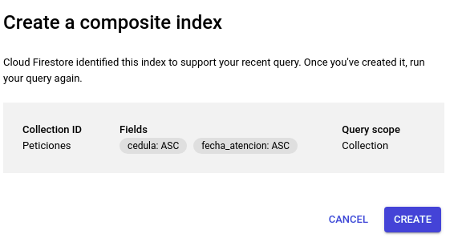
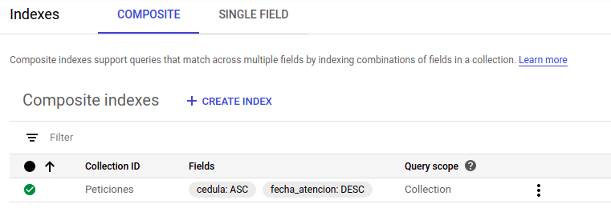

Vamos a incluir dos librerías en nuestro requirements.txt: firebase-admin para la conexión con bases de datos y pytz para el manejo de zonas horarias

```python
Flask==1.1.2
firebase-admin==4.3.0
pytz==2020.1
```
Debemos tener activo el entorno virtual, si no lo tenemos- Hacemos click en Terminal y ejecutamos los siguientes comandos:

```bash
.\venv\Scripts\activate
```


Si se genera el mensaje "Activate.ps1 is not digitally signed. You cannot run this script on the current system.", entonces debe ejecutar 

```bash
Set-ExecutionPolicy -ExecutionPolicy RemoteSigned -Scope Process
source .venv/bin/activate
```


Si esta trabajando en MacOs o Linux, ejecute los siguientes comandos

```bash
python3 -m venv .venv
source .venv/bin/activate

Luego, en la misma terminal ejecutamos el siguiente comando:

En Windows:

```bash
pip install -r requirements.txt
```

En MacOS/Linux:

```bash
pip3 install -r requirements.txt
```


Inclumos el siguiente código para conectarnos con Cloud FireStore y generar referencias a las Colecciones Estudiantes y Peticiones
```python
from flask import Flask, request, jsonify
from firebase_admin import credentials, firestore, initialize_app


app = Flask(__name__)

# Inicializar Firestore DB
cred = credentials.Certificate('key/key.json')
default_app = initialize_app(cred)
db = firestore.client()
estudiantes_ref = db.collection('Estudiantes')
peticiones_ref = db.collection('Peticiones')

if __name__ == '__main__':
    app.run(debug=True)
```

Vamos a generar dos Clases para nuestro modelo de datos (Estudiante y Petición), creamos una carpeta models y los archivos estudiante.py y peticion.py


Para la instancia de Peticiones debemos incluir la fecha en la zona horaria correcta, importamos pytz, datetime y asignamos la zona horaria
```python
import pytz
from datetime import datetime

timezone = pytz.timezone("America/Bogota")
```

La clase de petición sería la siguiente:
```python
class Peticion:
    def __init__(self, cedula, peticion, fecha_atencion):
        self.cedula = cedula
        self.peticion = peticion
        self.fecha_atencion = timezone.localize(datetime.strptime(fecha_atencion, '%d/%m/%y %H:%M:%S'))
        self.fecha_creacion = timezone.localize(datetime.now())


    def to_dict(self):
        return dict((key, value) for (key, value) in self.__dict__.items())
```


Ejercicio: Cree el modelo de Estudiante en el archivo estudiante.py dentro de la carpeta models, debe tener los siguiente campos: cedula, nombre, apellido, correo, carrera


Ahora vamos a crear un archivo __init__.py para importar los dos modelos

```python
from .estudiante import Estudiante
from .peticion import Peticion
```

Importamos los modelos en el app.py

```python
from flask import Flask, request, jsonify
from firebase_admin import credentials, firestore, initialize_app

from models import Estudiante,Peticion
```

Probemos crear una instancia de cada modelo para verificar que quedo bien
```python
nuevo_estudiante=Estudiante(122345, "Jaime", "Garcia", "jaime.garcia", "Electronica")
print(nuevo_estudiante.to_dict())
```


Ahora creamos una peticion de prueba
```python
nueva_peticion=Peticion(122345, "Asesoria",'25/09/20 7:00:00')
print(nueva_peticion.to_dict(),nueva_peticion.fecha_creacion,nueva_peticion.fecha_atencion)
```

El código completo que llevamos hasta el momento es el siguiente:
```python

from flask import Flask, request, jsonify
from firebase_admin import credentials, firestore, initialize_app

from models import Estudiante,Peticion

app = Flask(__name__)

# Inicializar Firestore DB
cred = credentials.Certificate('key/key.json')
default_app = initialize_app(cred)
db = firestore.client()
estudiantes_ref = db.collection('Estudiantes')
peticiones_ref = db.collection('Peticiones')


nuevo_estudiante=Estudiante(122345, "Jaime", "Garcia", "jaime.garcia", "Electronica")
print(nuevo_estudiante.to_dict())

nueva_peticion=Peticion(122345, "Asesoria",'25/09/20 7:00:00')
print(nueva_peticion.to_dict(),nueva_peticion.fecha_creacion,nueva_peticion.fecha_atencion)

if __name__ == '__main__':
    app.run(debug=True)
```


Vamos a agregar la primera ruta: POST para Agregar nuevos estudiantes
```python
@app.route("/api/estudiantes",methods=['POST'])
def agregar_estudiante():

    data=request.json
    estudiante_id=str(request.json["cedula"])
    try:  
        nuevo_estudiante=Estudiante(data["cedula"], data["nombre"], data["apellido"],data["correo"], data["carrera"]).to_dict()
        estudiantes_ref.document(estudiante_id).set(nuevo_estudiante)
        return jsonify(nuevo_estudiante),201
    except:
        error_message={"error":"Los datos del estudiante no están completos o son incorrectos"}
        return jsonify(error_message),400
```

Qué pasa si volvemos a crear un estudiante con la misma cédula?

Nos falta validar si ya existe un documento con el mismo ID, en cuyo caso retornamos error
```python
@app.route("/api/estudiantes",methods=['POST'])
def agregar_estudiante():

    data=request.json
    estudiante_id=str(request.json["cedula"])
    estudiantes_doc=estudiantes_ref.document(estudiante_id)
    if(estudiantes_doc.get().exists):
        error_message={"error":f"Ya existe un estudiante registrando con el ID {estudiante_id}"}
        return jsonify(error_message),400
    try:  
        nuevo_estudiante=Estudiante(data["cedula"], data["nombre"], data["apellido"],data["correo"], data["carrera"]).to_dict()
        estudiantes_doc.set(nuevo_estudiante)
        return jsonify(nuevo_estudiante),201
    except:
        error_message={"error":"Los datos del estudiante no están completos o son incorrectos"}
        return jsonify(error_message),400
```

Continuemos con la ruta de GET para Obtener la información de un estudiante

Request

Metadata about the request
• Content Type: The format of Content
• Content Length: Size of Content
• Authorization: Who’s making the call
• Accept: What type(s) can accept
• Cookies: Passenger data in the request
• More headers…


Content Concerning Request
• HTML, CSS, JavaScript, XML, JSON
• Content is not valid with some verbs
• Information to help fulfill request
• Binary and blobs common (e.g. .jpg)


Response


Operation Status
• 100-199: Informational
• 200-299: Success
• 300-399: Redirection
• 400-499: Client Errors
• 500-599: Server Errors


Metadata about the response
• Content Type: The format of Content
• Content Length: Size of Content
• Expires: When to consider stale
• Cookies: Passenger data in the request
• More headers…

Content
• HTML, CSS, JavaScript, XML, JSON
• Binary and blobs common (e.g. .jpg)
• APIs often have their own types


Versionado

Should You Version Your API?
- Once you publish, it’s set in stone
- Users rely on the API not changing
- But requirements will change


/v1/estudiantes/1324345/tareas


Ejercicio: Crear las Rutas para Put and Delete con Conexión a la base de datos y validación


Continuamos con la ruta de peticiones. Primero vamos a crear el POST para Agregar peticiones relacionadas con un estudiante
```python
@app.route("/api/estudiantes/<int:id>/peticiones",methods=['POST'])
def crear_peticion(id):

    data=request.json
    estudiante_id=str(id)
    estudiante_doc=estudiantes_ref.document(estudiante_id)

    if(estudiante_doc.get().exists):
        try:  
            nueva_peticion=Peticion(data["cedula"], data["peticion"], data["fecha_atencion"]).to_dict()
            peticion_ref=peticiones_ref.add(nueva_peticion)
            nueva_peticion["id"]=peticion_ref[1].id

            return jsonify(nueva_peticion),200
        except:
            error_message={"error":"Los datos de la petición no están completos o son incorrectos"}
            return jsonify(error_message),400
    else:
        error_message={"error":f"No se encontró ningún estudiante con el ID {id}"}
        return jsonify(error_message),400
```


Ahora vamos a generar la ruta GET para obtener todas las peticiones de un estudiantes

```python
@app.route("/api/estudiantes/<int:id>/peticiones",methods=['GET'])
def obtener_peticiones(id):

    estudiante_id=str(id)
    estudiante_doc=estudiantes_ref.document(estudiante_id)

    if(estudiante_doc.get().exists):
        try:  
            query = peticiones_ref.where('cedula','==',id).order_by('fecha_atencion')
            results = query.stream()
            lista_peticiones=[to_dict_with_id(item) for item in results]
            return jsonify({"data":lista_peticiones}),200
        except Exception as err:
            error_message={"error":"Los datos de la petición no están completos o son incorrectos"}
            return jsonify(error_message),400
    else:
        error_message={"error":f"No se encontró ningún estudiante con el ID {id}"}
        return jsonify(error_message),400
```

Para generar la respuesta, vamos a crear una función que tome cada resultado, lo convierta diccionaro y le incluya el id del documento


```python
def to_dict_with_id(item):
    print(item,item.id)
    item_dict=item.to_dict()
    item_dict["id"]=item.id
    return item_dict
```

Cuando ejecutamos la consulta, vamos a ver que da el siguiente error

### Obtener Peticiones
GET http://localhost:5000/api/estudiantes/{{cedula2}}/peticiones
Content-Type: application/json


Si vamos al enlace que nos genera el error, nos va a dar la posibilidad de crear un índice compuesto, hacemos click en Crear



Después de unos minutos, el índice quedará creado, si volvemos a hacer la consulta, esta vez funcionará correctamente




Ejercicio: Realizar las rutas GET para Obtener una Petición, PUT para Actualizarla y DELETE para borrarla


